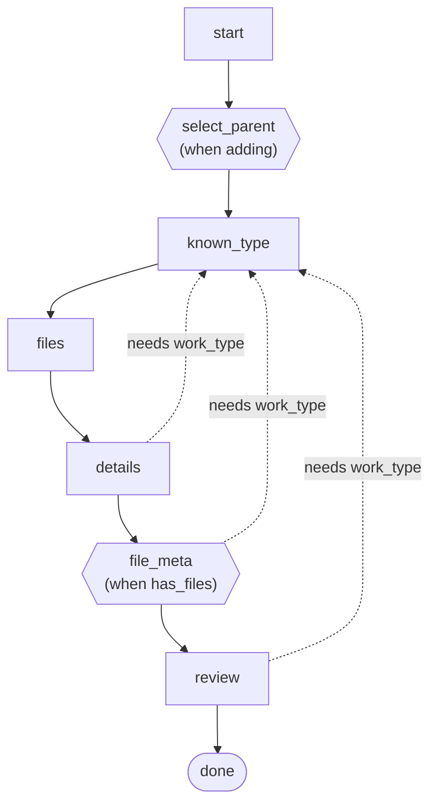
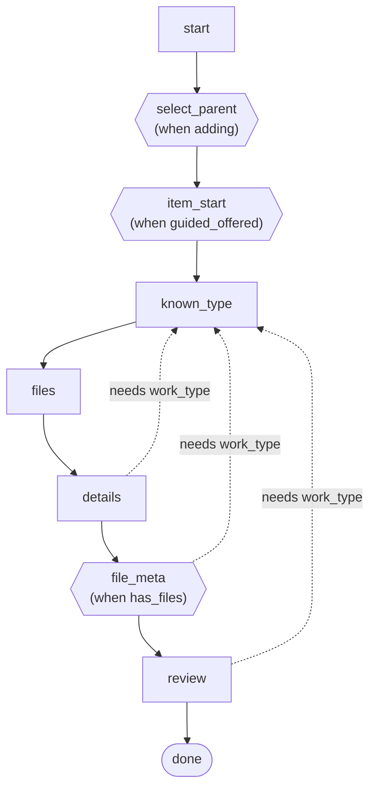
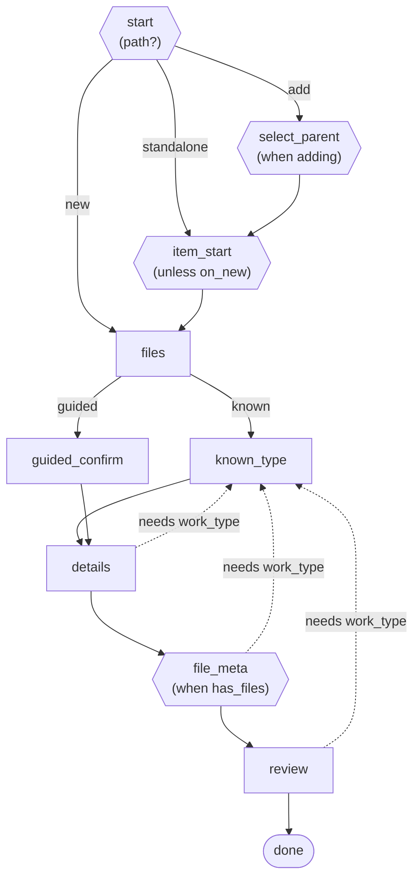

# flow_wizard

A dependency-free, controller-agnostic engine for **multi-step wizard flows**. A
flow is an ordered list of steps as plain data, plus a navigator
(next/back/detour/skip/progress-rail). Steps reference **named conditions**, so a
flow is both **buildable** (a small DSL) and **self-documenting** (it renders to a
Mermaid diagram).

Your app *queries* the flow — the gem never takes over your controller, and it
assumes nothing about your models or storage.

## Why not wicked / a state machine / trailblazer?

Those either take over the controller (you can't swap the step list as data),
model states-and-transitions rather than an ordered walk with skips and detours, or
execute a service pipeline within one request rather than spanning the request
cycle. `flow_wizard` occupies the gap: **request-spanning UI navigation, modeled as
swappable data, with prerequisite-detours and a collapsing progress rail.**

## Install

```ruby
gem "flow_wizard"
```

## Define a flow

```ruby
flow = FlowWizard::Flow.build do
  condition :adding,       ->(state, _config) { state.path == "add" }
  condition :has_files,    ->(state, _config) { state.uploaded_file_ids.any? }
  prerequisite :work_type, ->(state, _config) { state.work_type }, detour: :known_type

  step :start, rail: :type
  step :select_parent, skip_unless: :adding, on_skip: :entry, rail: :parent
  step :known_type, rail: :type
  step :files, rail: :upload
  step :details, requires: :work_type, rail: :detail
  step :file_meta, requires: :work_type, skip_unless: :has_files, rail: :file_detail
  step :review, requires: :work_type, rail: :review
  step :done, terminal: true
end
```

`skip_unless: :adding` reads as intent ("show this step only when adding");
`requires: :work_type` means "if the work type isn't set yet, detour to the step
that sets it." Both reference **named** conditions, which is what makes the diagram
below possible — an inline `->(s,c){...}` can be evaluated but not described.

For a set of **mutually-exclusive** steps chosen by one decision variable, declare a
`branch`. It generates the per-value skip conditions and records the fork so the
diagram draws it as a real branch (see the diagrams below):

```ruby
branch :type_mode, on: ->(state, _config) { state.type_mode },
       known: :known_type, guided: :guided_confirm
```

When a step *routes* to several **already-gated** downstream steps that may be shared
or convergent — a fork that doesn't fit `branch`'s one-value-one-exclusive-step shape
— declare a `decision`. It records the fork for the diagram only: it generates no
conditions and changes no navigation (the target steps keep their own skips).

```ruby
decision :path, from: :start,
         add: :select_parent, standalone: :item_start, new: :files
```

## Navigate

The navigator methods take your own `state` (any object your conditions understand)
and an optional `config`:

```ruby
flow.next_after("files", state, config)   # => "details"  (skips file_meta when no files)
flow.back_before("details", state, config) # => "files"
flow.detour_for("details", state, config)  # => "known_type" until work_type is set, else nil
flow.visible_steps(state, config)          # => the steps to show for this state
flow.rail(state, config)                   # => [{ key:, icon:, label_key: }, ...] progress rail
```

`Transition` is the small result object your controller turns into a redirect or a
re-render:

```ruby
FlowWizard::Transition.advance("details", notice: "Type selected")
FlowWizard::Transition.rerender("known_type", alert: "Pick a type")
```

## Self-documenting diagrams

```ruby
puts flow.to_mermaid
```

produces Mermaid source that renders as a live diagram in GitHub, PRs, and docs —
no image tooling. It reads like the *process*, not the raw step array:

- **Hexagons** are conditional steps, labeled *positively* from the named condition
  (`when adding`, not the internal double negative `if not_adding`).
- **Solid edges** are the sequential walk; the **stadium** node is a terminal step.
- **Dashed labeled edges** are prerequisite detours (`needs work_type`).
- A declared **`branch`** renders as a real fork — the step before it points to each
  alternative with a value-labeled edge, and the alternatives converge again.



Because the flow is data, a consuming app can add steps and conditions without
changing any of the navigation — and the diagram grows with it. Adding an
`item_start` chooser (shown only when a guided sub-flow is offered) reads clearly:



A fully forked flow reads just as clearly. Two forks and a convergence: a `decision`
on `path` routes the `start` screen to three intents (add / standalone / new), which
reconverge at `files`; then a `branch` on `type_mode` forks into two ways to pick a
work type — `known` (go straight to the type list) vs a file-driven `guided` step:

```ruby
decision :path, from: :start,
         add: :select_parent, standalone: :item_start, new: :files
branch :type_mode, on: ->(state, _config) { state.type_mode },
       known: :known_type, guided: :guided_confirm
```

Each fork's edges are labeled by the value that selects them, and the paths converge
again — no misleading straight line through steps that are really siblings:



## State and Config bases

`FlowWizard::State` wraps a plain hash (typically your session bag) — subclass it and
add typed accessors for your domain's slots; `#extra` is a namespaced bag for
ad-hoc state, and `#to_h` gives the raw hash back for the session.
`FlowWizard::Config` holds a swappable `flow` plus whatever settings your app needs;
feature-flag / host reads live in *your* subclass, keeping the engine host-free.

## Design notes

- **Steps are data.** A downstream app reshapes the flow by assigning a new `Flow`
  (or editing the builder block) — no controller subclassing.
- **Named conditions are the core abstraction.** They make flows legible and
  diagrams labeled. Raw lambdas still work as an escape hatch, but only named
  conditions get labeled edges.
- **Zero runtime dependencies.** The gem loads with `require "flow_wizard"` alone.

## License

Apache-2.0.
