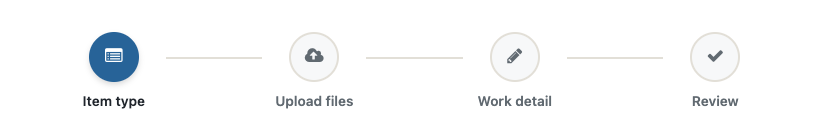

# Authoring flows

A flow is written in a small builder _Domain-Specific Language_ (DSL). This page is the
guide to writing one: **Anatomy of a flow** walks each declaration, and the reference
tables that follow map each term to what you **write** and what it **means**.

For how those terms *render* as node shapes and edges, see
[DIAGRAMS.md](DIAGRAMS.md); for wiring a flow into an app,
[INTEGRATION.md](INTEGRATION.md).

## Anatomy of a flow

A `Flow.build { … }` block is a set of declarations. They can appear in any order — the
builder resolves references after reading them all — but the natural order to *think*
in is: name the reusable pieces (conditions, prerequisites), declare any forks, then
list the steps that use them.

### The bare minimum

Only two things are required for a flow to be *valid*: **at least one `step`**, and **at
least one `terminal:` step** (an end for the walk). Everything else — conditions,
prerequisites, forks, the rail — is optional:

```ruby
flow = FlowWizard::Flow.build do
  step :start
  step :done, terminal: true
end
```

This validates (`flow.validate` returns `[]`), but it doesn't do anything useful — it
walks `start → done` with no choices along the way. It's the floor, not a goal: a real
flow adds more steps to walk, and the conditions/forks below are what make those steps
*conditional*. The point of this example is only to show what's mandatory (a step and a
terminal) versus what you add on top.

### A fuller example

A more realistic flow names a condition and a prerequisite, then uses them on its
steps:

```ruby
flow = FlowWizard::Flow.build do
  condition :adding,       ->(state, _config) { state.path == "add" }
  prerequisite :work_type, ->(state, _config) { state.work_type }, detour: :pick_type

  step :start
  step :select_parent, skip_unless: :adding   # shown only when adding
  step :pick_type                              # where a work type gets set
  step :details, requires: :work_type          # deferred until work_type is set
  step :review,  requires: :work_type
  step :done, terminal: true
end
```

The rest of this page defines each declaration used above — and the few not shown
(`branch`, `decision`, the rail options) — one at a time.

### Kinds of things in a flow

Six kinds of token appear in a flow, and telling them apart is the biggest part of understanding
one. Each has a marker (used in the reference tables below) and a distinctive Ruby
shape, so you can usually identify a token on sight without the marker:

| Marker | Kind | Looks like (Ruby) | What it is |
|:------:|------|-------------------|------------|
| 🔑 | [**keyword**](#the-builder-verbs) | bare word, no colon | A DSL word the builder provides — you *call* it: `condition`, `prerequisite`, `branch`, `decision`, `step`, `rail_order`. |
| ⚙️ | [**option**](#step-keywords) | trailing colon | A keyword argument that configures a keyword: `on:`, `from:`, `detour:`, `requires:`, `skip_unless:`, `skip_if:`, `rail:`, `rail_if:`, `on_skip:`, `terminal:`, `icon:`, `label_key:`. |
| ❓ | [**condition-name**](#condition--a-named-test) | `:symbol` you invent | A name you bind to a lambda via `condition`/`prerequisite`, then reference from `skip_unless:` / `requires:` / etc. E.g. `:adding`, `:work_type`. |
| 👣 | [**step-name**](#step--one-stage-in-the-flow) | `:symbol` you invent | A name you give a `step` — one stage in the flow (usually a screen the user sees). Referenced by `detour:`, `branch`/`decision` targets, and the navigator. E.g. `:start`, `:known_type`. |
| 🎯 | [**value**](#branch--one-variable-one-exclusive-step-per-value) | `"quoted string"` | A value your state can hold, returned by a `branch`'s `on:` lambda and used as its map key / fork-edge label. E.g. `"add"`, `"known"`. Data, not a name you declare. |
| λ | [**lambda**](#the-lambda--the-shared-building-block) | `->(state, config) { … }` | The `(state, config)` code block a condition/prerequisite name is bound to, or that `on:` / raw `skip_if:` / `rail_if:` take inline. |

The two that collide are **❓ condition-name** and **👣 step-name** — both are `:symbol`,
but they live in separate namespaces. Referencing one where the other belongs (e.g.
`requires:` a step-name, or a `detour:` to a condition-name) is a mistake
[`Flow#validate`](../README.md#validate-a-flow) catches.

### The lambda — the shared building block

```ruby
->(state, config) { state.path == "add" }
```

A **lambda** is the `(state, config)` code block that every other declaration builds on:
`condition` and `prerequisite` bind one to a name, and `branch`'s `on:` takes one
inline. `state` is the per-user wizard state (your slots — `state.path`,
`state.work_type`); `config` is your app settings (a feature flag, a tenant/host value).

> **Every lambda must accept `(state, config)` — both arguments.** The navigator always
> calls them with two, so a one-arg `->(state) { … }` raises `ArgumentError`. You need
> not *use* both: name the one you want and underscore the other (`->(state, _config)`),
> and `config` is unused in most lambdas. Using neither is fine too —
> `->(_state, _config) { true }` is a valid constant lambda. This applies everywhere a
> lambda appears: `condition`, `prerequisite`, `branch`'s `on:`, and raw `skip_if` /
> `rail_if`. [`Flow#validate`](#validating-a-flow) catches a wrong-arity lambda at build
> time, so you don't have to hit the runtime error to find it.

### `condition` — a named test

```ruby
condition :adding, ->(state, _config) { state.path == "add" }
```

A `condition` binds a name to a [lambda](#the-lambda--the-shared-building-block) — a
**named true/false test** over your state. The name (`:adding`) is a symbol you
reference later; the lambda returns truthy/falsey (here by reading `state.path`). Naming
the test once is what lets both the navigator evaluate it *and* the diagram label it —
steps refer to `:adding`, not to an inline lambda.

> **State slots and their values are your app's, not the flow's.** `state.path` and the
> value `"add"` are defined by *your* application — your controller sets them (see
> [INTEGRATION.md](INTEGRATION.md#1-define-your-state)); the flow only ever *reads and
> compares*. It never defines a slot, enumerates its legal values, or validates them.
> One consequence: a value can drive routing without being named anywhere — if only
> `"add"` and `"new"` are tested, every other value (`"standalone"`, or a typo) is the
> untested *fall-through*. The flow can't police your state's vocabulary; that's your
> app's job.

Conditions gate three things later: a step's visibility (`skip_if` / `skip_unless`), a
rail phase's visibility (`rail_if`), and — via `on:` lambdas — the value a `branch`
forks on.

### `prerequisite` — a requirement with a fallback step

```ruby
prerequisite :work_type, ->(state, _config) { state.work_type.present? }, detour: :known_type
```

A `prerequisite` is a condition that, when **false**, means "the user isn't ready for a
step that needs this — send them somewhere to satisfy it." It has three parts:

- **name** (`:work_type`) — steps reference it with `requires: :work_type`.
- **lambda** — the test (here, "is a work type set?").
- **`detour:`** (`:known_type`) — **the step to redirect to** when the test is false.
  This is a *step name*, and it's where the user goes to fix the missing requirement
  (the `known_type` step is where a work type gets chosen).

`detour:` is the target of the dashed guard edges in the diagram. A step that
`requires: :work_type` is not *hidden* when the work type is missing — it is
**deferred**: visiting it redirects to `known_type` until the requirement is met.

### `branch` — one variable, one exclusive step per value

```ruby
branch :type_mode, on: ->(state, _config) { state.type_mode },
       known: :known_type, guided: :guided_confirm
```

A `branch` declares a set of **mutually-exclusive** steps chosen by one variable:

- **variable** (`:type_mode`) — the name, also the fork's diagram label.
- **`on:`** — a lambda returning the *current value* of that variable (e.g. `"known"`).
- **the value → step map** (`known: :known_type, guided: :guided_confirm`) — reads as
  *"value → the step to show for it"*: when the value is `known`, the `known_type` step
  shows; when `guided`, `guided_confirm` shows.

> **The value is matched as a string.** You write the keys as symbols (`known:`), but
> `branch` compares `on.call(...) == "known"` — it stringifies the key. So your `on:`
> lambda must return the **string** `"known"`, not the symbol `:known`, or nothing
> matches. (This is why the real flows read a string slot — `state.type_mode` or
> `state.extra["type_mode"]`.)

The keys also become the fork's edge labels in the diagram (`files -->|known| …`), and
`branch` **generates the skip conditions** for the mapped steps, so exactly one shows —
you do **not** also write `skip_unless:` on them. Use it when each value has its own
distinct step (a clean fork).

### `decision` — a routing fork over already-gated steps

```ruby
decision :path, from: :start,
         add: :select_parent, standalone: :item_start, new: :files
```

A `decision` also forks on a variable, but it is **diagram-only** — it generates no
conditions and changes no navigation:

- **variable** (`:path`) — a **label you invent**, nothing more. Unlike `branch`, a
  decision has **no `on:` lambda**, so this name is *not* read from state and need not
  match any slot — it exists only to annotate the fork in the diagram (`start` renders
  as `(path?)`). Pick a name that tells the reader what decides the fork; the actual
  gating lives on the target steps (below).
- **`from:`** (`:start`) — the step the fork *starts from* (the diagram draws the fork
  out of `start`).
- **the value → step map** — same `value: :step` shape as `branch`, but here the step
  is *where that value routes to* (possibly a shared step), not a value-exclusive step.
  The values are used only as **edge labels** — no `on:` lambda, no string comparison
  to get right.

The difference from `branch`: a decision's target steps are **already gated by their
own skips** (e.g. `item_start` has `skip_if: :on_new`), and they may be **shared or
convergent** (here `new` routes straight to `files`, which the other paths also reach).
Use `decision` when the routing doesn't fit `branch`'s one-value-one-exclusive-step
shape. (The "**`branch` vs `decision`**" callout at the end of this page compares them
side by side.)

### `step` — one stage in the flow

```ruby
step :details, requires: :work_type, rail: :detail, icon: "fa-pencil", label_key: "detail"
```

A `step` is one named stage in the flow — a position the navigator can be at. Usually
that's a screen the user sees and fills in, but a step can also be a pure routing point
(`start`), a session mutation with no UI of its own, or a `terminal:` end-state; whether
it renders as a screen is up to your app. Each `step` carries optional metadata that
references the pieces above. Every keyword is defined in the
[`step` keywords](#step-keywords) table — in short:
`requires:` guards it behind a prerequisite, `skip_unless:` / `skip_if:` gate its
visibility on a condition, `rail:` / `rail_if:` place it on the [progress
strip](#the-rail--the-progress-indicator), `on_skip:` decides where a direct visit
lands when the step is skipped, and `terminal:` marks an end of the flow.

### `rail_order` — the progress-strip order

```ruby
rail_order :parent, :type, :upload, :detail, :file_detail, :review
```

Lists the **rail phases** (the `rail:` keys, *not* the steps) in the order they appear
on the progress strip. Several steps can map to one phase, so this list is usually
shorter than the step list, and its order is independent of the walk order. Optional —
without it, phases appear in the order steps first introduce them. See [the
rail](#the-rail--the-progress-indicator).

### Validating a flow

Because a flow is data, a typo in a name fails *silently* at runtime — a `requires:`
that names a ❓ condition that doesn't exist simply never detours; a `branch` edge to a
misspelled 👣 step points at nothing. `Flow#validate` catches these the moment the flow
is built. It returns a list of problems (empty when the flow is sound):

```ruby
flow = Flow.build { … }

flow.validate
# => ["step \"details\": requires :work_typo, which is not declared",
#     "flow has no terminal step (declare one with terminal: true)"]

flow.valid?    # => true / false
flow.validate! # => the flow if sound; raises FlowWizard::Flow::InvalidFlow otherwise
```

It checks that every named `skip_if` / `rail_if` / `requires` resolves to a declared
❓ condition, that each `prerequisite`'s `detour:` and every `branch` / `decision`
target names a real 👣 step, that the flow has at least one `terminal:` step, and that
every λ lambda can accept `(state, config)` — a wrong-arity lambda that would raise
`ArgumentError` mid-navigation is caught here. (A lambda's *logic* still can't be
checked — only its signature.) This is also where the ❓/👣 [namespace
collision](#kinds-of-things-in-a-flow) gets caught — a `requires:` pointed at a
step-name, or a `detour:` at a condition-name, is reported here. For *where* to call it
in an app (a boot check, a test), see
[INTEGRATION.md](INTEGRATION.md#validating-a-flow-at-boot).

## How the terms render in a diagram

The DSL terms above become node shapes and edges in the flowchart `flow.to_mermaid`
produces — rectangles vs. hexagons vs. the terminal stadium, solid walk edges vs.
labeled forks vs. dashed prerequisite guards, and the positive `(when …)` / `(unless
…)` hexagon labels. That mapping — every shape, edge, and label — lives in
**[DIAGRAMS.md § Diagram reference](DIAGRAMS.md#diagram-reference)**, alongside a full
worked example.

## The "rail" — the progress indicator

The **rail** is the progress strip a wizard shows the user: the "Step 2 of 5"
breadcrumb / stepper across the top that marks where they are and what's left. "Rail"
is just this gem's name for that strip; it does **not** appear in the Mermaid diagram —
it's a separate view your app renders from `flow.rail(state, config)`.



The strip is divided into **phases** — the markers the user sees (in the image above:
"Item type", "Upload files", …). You put a step on the strip by tagging it with a phase key: `rail: :type`
means "this step belongs to the `type` phase." A phase isn't declared anywhere on its
own; it exists because one or more steps point at its key. When several steps share a
key they collapse into one marker — e.g. two type-picking steps both `rail: :type` show
as a single "Type" marker. `rail_order` sets the left-to-right order of those markers,
independent of the walk order, so the strip reads cleanly even when the steps branch.
`rail_if:` hides a step's phase until a condition holds (a phase that only becomes
relevant partway through).

`flow.rail(state, config)` returns the phases to render; `flow.rail_view(state, config,
current_step:)` returns them enriched with a `:status` (`:done` / `:current` /
`:upcoming`) and 1-based `:position`, so a view can style the strip without recomputing
where the user is. None of this is in the flowchart — see
[INTEGRATION.md](INTEGRATION.md#5-the-progress-rail) for rendering it.

## The builder verbs

Each row is a 🔑 **keyword** you call in `Flow.build { … }`. The **Takes** column names
the kinds it consumes (markers from [Kinds of things](#kinds-of-things-in-a-flow)):

| Keyword | Takes | Declares |
|---------|-------|----------|
| `condition` | ❓ name, λ lambda | A named predicate over `(state, config)`. |
| `prerequisite` | ❓ name, λ lambda, `detour:` → 👣 step-name | A condition that, when unmet, redirects a `requires:`-ing step to its `detour:` step. |
| `branch` | variable, `on:` → λ, 🎯 value → 👣 step map | Mutually-exclusive steps chosen by one variable; generates their skip conditions. |
| `decision` | variable, `from:` → 👣 step, 🎯 value → 👣 step map | A **diagram-only** routing fork to already-gated, possibly-shared steps. Generates no conditions. |
| `step` | 👣 name, then ⚙️ options (table below) | One step, with its skips/prerequisites/rail/display metadata. |
| `rail_order` | phase keys (symbols) | The order phases appear on the progress strip (independent of walk order). See "the rail" above. |

### `step` keywords

Each is a ⚙️ **option** on `step`. The **Takes** column names the *kind* of value it
expects (markers from [Kinds of things](#kinds-of-things-in-a-flow)):

| Option | Takes | Meaning |
|--------|-------|---------|
| `requires:` | ❓ condition-name (a prerequisite) | Guards the step behind that prerequisite: if unmet, a visit *redirects* to its `detour:` step (deferred, not hidden). |
| `skip_unless:` | ❓ condition-name | Show only when that condition holds. |
| `skip_if:` | ❓ condition-name *or* λ lambda | Skip (hide) when it holds. A raw lambda works but gets no diagram label. |
| `terminal:` | `true` | The flow ends at this step. |
| `on_skip:` | `:forward` or `:entry` | Where a *direct* visit lands when this step is skipped: `:forward` (default — pass through to the next visible step) or `:entry` (bounce to the first step). Use `:entry` for a step that makes no sense out of context. Only affects direct/abnormal visits. |
| `rail:` | phase key (a symbol) | Which progress-strip phase this step belongs to (steps sharing a key collapse to one marker). See "the rail" above. |
| `rail_if:` | ❓ condition-name *or* λ lambda | Show this step's phase only when it holds. |
| `icon:` / `label_key:` | strings | The icon and i18n label shown for this step's phase on the strip. |

> **`branch` vs `decision`** — both draw a fork, and the distinction is worth keeping
> straight. `branch` *gates*: it generates the per-value skip conditions, for a clean
> "one value → its own exclusive step" split. `decision` is *draw-only*: it generates
> nothing and just reroutes edges in the diagram, for a fork whose targets are already
> gated by their own skips and may be shared or convergent.
