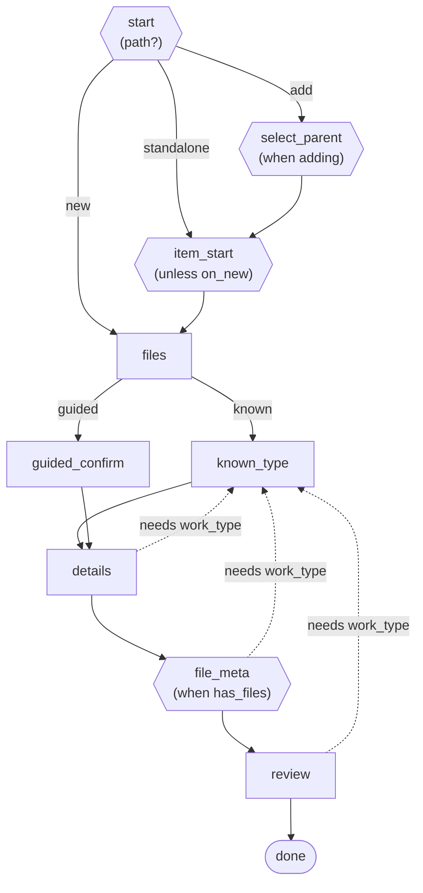

# Diagrams

`Flow#to_mermaid` renders a flow as a Mermaid `flowchart` that drops straight into
GitHub markdown, a PR description, or docs — no image tooling. This page has two parts:
a **[diagram reference](#diagram-reference)** — what every shape, edge, and label means
— and a **[worked example](#a-worked-example)** that shows them in context.

For what the DSL *terms* are (as opposed to how they render), see
[AUTHORING-FLOWS.md](AUTHORING-FLOWS.md). The [README](../README.md) shows a simple flow if you
just want the shape of the output.

## Diagram reference

### Node shapes

Every step is a node; its shape tells you its role at a glance:

| Shape | Mermaid | Role |
|-------|---------|------|
| **Rectangle** | `step["name"]` | A plain step — always shown when the walk reaches it. |
| **Hexagon** | `step{{"name<br/>(…)"}}` | A *conditional* step or a *fork* point. The parenthetical says why (a condition) or what it routes on (a variable). |
| **Stadium** (rounded ends) | `step(["name"])` | A *terminal* step — the flow ends here. Declared `terminal: true`. |

### Edges

| Edge | Mermaid | Means |
|------|---------|-------|
| **Solid** | `a --> b` | The forward walk: after step `a`, go to step `b`. |
| **Labeled solid (fork)** | `a -->\|value\| b` | A `branch` or `decision` route: from `a`, the `value` case goes to `b`. |
| **Dashed labeled** | `a -. needs x .-> b` | A **guard, not a route** (see below): step `a` requires `x`; if reached without it, redirect to `b`. |

### Hexagon labels

The parenthetical inside a hexagon has three forms, depending on how the step was
declared:

| You write | Diagram shows | Means |
|-----------|---------------|-------|
| `skip_unless: :adding` | `(when adding)` | Show this step **only when** `adding` is true. |
| `skip_if: :on_new` | `(unless on_new)` | Show this step **unless** `on_new` is true (i.e. hide it when true). |
| `decision :path, from: :start, …` | `(path?)` on `start` | This step **routes on** the `path` variable; the outgoing labeled edges are the choices. |

`when` and `unless` are opposite frames on purpose — `skip_unless` and `skip_if` are
opposite conditions, so the diagram states each honestly rather than forcing both into
one word (which would reintroduce a double negative like "when not new"). Read it as:
**`when` = shown if the condition holds; `unless` = shown if it does not.** Labels are
always *positive* — `skip_unless: :adding` renders `(when adding)`, never the internal
double negative `(if not_adding)`.

### Dashed edges are guards, not routes

This is the diagram's least obvious convention, so it gets its own note.

A dashed `-. needs x .->` edge does **not** mean "the walk goes here next." It means:
this step declares `requires: :x` (a named prerequisite), and if a visitor ever reaches
the step without `x` satisfied, `detour_for` redirects them to the prerequisite's
`detour:` step. Two consequences that surprise first readers:

- **It can point backward.** Solid = "next"; dashed = "only if a prerequisite is
  missing." A backward dashed arrow is a redirect, not a loop.
- **In a well-ordered flow it never fires.** The walk order already guarantees the
  prerequisite is set before the step is reached, so a normal click-through never sees
  the redirect. The guard exists for *out-of-order* entry — a bookmarked URL, a
  back-button jump, tampered state.

Several dashed edges converging on one step means "these steps all require the same
thing," because a prerequisite names a single `detour:` target — the one place it is
satisfied — not a step the walk passes through repeatedly.

## A worked example

The rest of this page walks one **complete** flow — the builder that defines it, the
diagram it renders, and a line-by-line reading — so the reference above is shown in
context.

### The flow

A deposit wizard with **two forks and a convergence**. A depositor picks an intent on
`start` (`add` / `standalone` / `new`), the paths reconverge at `files`, then a second
fork chooses how to set the work type (`known` vs a file-driven `guided` step):

```ruby
flow = FlowWizard::Flow.build do
  # Order the progress-strip phases (independent of the step/walk order below).
  rail_order :parent, :type, :upload, :detail, :file_detail, :review

  # Named true/false tests over state, referenced by steps further down.

  # Depositor is adding to an existing parent.
  condition :adding, ->(state, _config) { state.path == "add" }

  # Depositor is creating a new container.
  condition :on_new, ->(state, _config) { state.path == "new" }

  # Any files uploaded yet?
  condition :has_files, ->(state, _config) { state.uploaded_file_ids.any? }

  # A prerequisite: a step that `requires: :work_type` detours to :known_type
  # until a work type is set.
  prerequisite :work_type, ->(state, _config) { state.work_type.present? }, detour: :known_type

  # Includes a named decision point in the mermaid diagram for visual clarity; does NOT
  # affect the actual flow's routing. The real routing is done by the target steps' own
  # conditions — delete this line and the flow behaves identically, only the diagram
  # changes. (See those target steps below for what each path shows.)
  decision :path, from: :start,
           add: :select_parent, standalone: :item_start, new: :files

  # Two mutually-exclusive ways to set the work type, keyed on the chosen mode:
  # a real branch (generates the per-value skips, records the fork).
  branch :type_mode, on: ->(state, _config) { state.type_mode },
         known: :known_type, guided: :guided_confirm

  # The steps, in walk order. Each names its rail phase; some are gated.

  # Entry; the next step depends on state.path.
  step :start, rail: :type

  # Shown only when adding; a direct visit otherwise bounces back to entry.
  step :select_parent, skip_unless: :adding, on_skip: :entry, rail: :parent, rail_if: :adding

  # Skipped on the "new" path.
  step :item_start, skip_if: :on_new, rail: :type

  # Upload; where the paths reconverge.
  step :files, rail: :upload

  # Branch target: pick a type directly.
  step :known_type, rail: :type

  # Branch target: infer the type from the uploaded files.
  step :guided_confirm, rail: :type

  # Needs a work type (guarded — detours until one is set).
  step :details, requires: :work_type, rail: :detail

  # Metadata per file; shown only when files exist, and its rail phase likewise.
  step :file_meta, requires: :work_type, skip_unless: :has_files, rail: :file_detail, rail_if: :has_files

  # Final review (guarded).
  step :review, requires: :work_type, rail: :review

  # End of the walk.
  step :done, terminal: true
end
```

### The diagram

`puts flow.to_mermaid` produces:



### Reading it

Every shape and edge here is defined in the [diagram reference](#diagram-reference)
above; this walks how they combine in *this* flow. At a glance: `files`, `known_type`,
`details` are plain rectangles; `start`, `select_parent`, `item_start`, `file_meta` are
hexagons (conditional or fork); `done` is the terminal stadium.

#### The `start` fork (a `decision`)

```
start -->|add| select_parent
start -->|standalone| item_start
start -->|new| files
```

`start` is where the depositor chooses an intent. The three intents are **siblings**,
not a sequence — so the diagram fans out from `start`, each edge labeled by the value
that selects it. `new` skips straight to `files` because that path sets its work type up
front and needs neither the parent chooser nor the item chooser.

A `decision` is **diagram-only**: it draws this fork but generates no conditions and
changes no navigation. Each target step is gated by its *own* skip (`select_parent` is
`skip_unless: :adding`, `item_start` is `skip_if: :on_new`), which is why the fork can
point at steps that are shared between paths.

#### The convergence

```
select_parent --> item_start
item_start --> files
```

After the fork the paths merge again: `add` flows `select_parent -> item_start`, then
`add` and `standalone` both meet at `item_start -> files`, and all three meet at
`files`. These are ordinary solid edges — the fork changed where each path *enters*,
not the walk that follows.

#### The `files` fork (a `branch`)

```
files -->|known| known_type
files -->|guided| guided_confirm
known_type --> details
guided_confirm --> details
```

Two **mutually-exclusive** ways to set the work type. Unlike the `decision`, a
`branch` *does* gate: it generates the `type_mode_is_known` / `type_mode_is_guided`
skip conditions so exactly one of the two steps shows. Both alternatives converge on
`details`. The value labels (`known` / `guided`) carry the reason, so the two steps
render as plain rectangles rather than repeating the condition inline.

#### The dashed guards

```
details   -. needs work_type .-> known_type
file_meta -. needs work_type .-> known_type
review    -. needs work_type .-> known_type
```

Three [prerequisite guards](#dashed-edges-are-guards-not-routes) sharing one detour:
`details`, `file_meta`, and `review` each `requires: :work_type`, so any visit without
a work type set redirects to `known_type`. They all point at the *same* step because a
prerequisite names a single `detour:` target — the one place it is satisfied — not a
step the walk passes through three times. In normal use none fires: the walk sets the
work type (at `known_type` or `guided_confirm`) before any of these steps is reached.

> One honest wrinkle this example exposes: the `guided` path sets its type at
> `guided_confirm`, but the prerequisite's `detour:` is `known_type` for everyone. In
> normal use a guided depositor reaches `details`/`review` with a type already set, so
> the guard never fires — but if it *did*, it would send them to `known_type` rather
> than back to `guided_confirm`. A prerequisite carries one detour target; per-path
> detours are a modeling choice a flow would have to make explicitly.

## Direction

`to_mermaid` defaults to top-down (`flowchart TD`). Pass `direction:` for a
left-to-right layout, which often reads better for long linear flows:

```ruby
puts flow.to_mermaid(direction: "LR")
```
